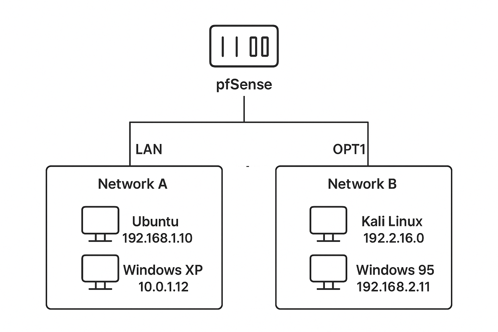
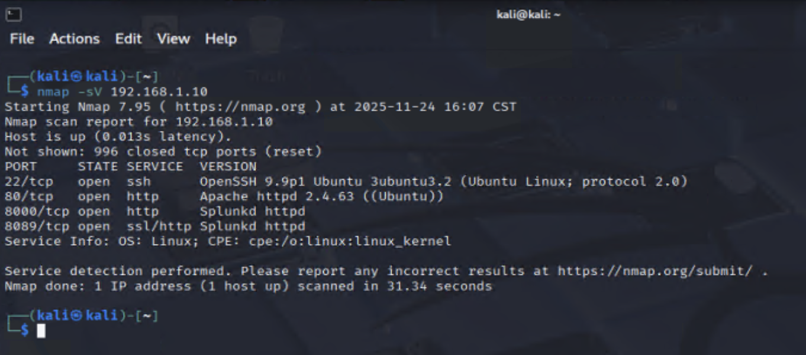
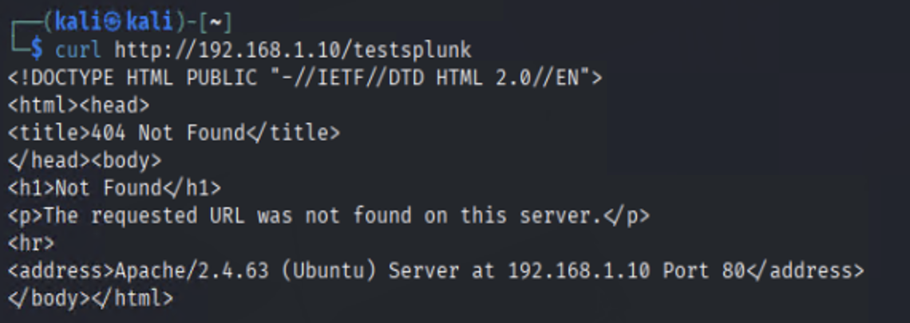
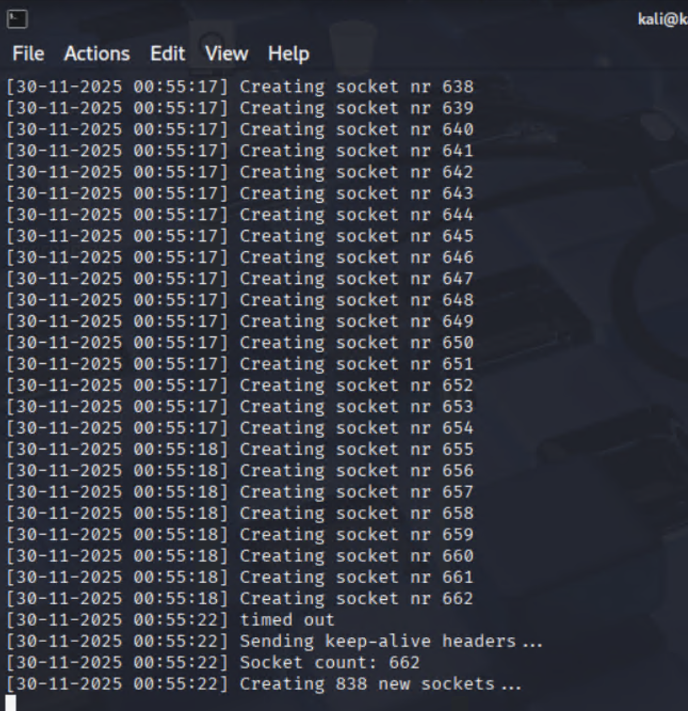
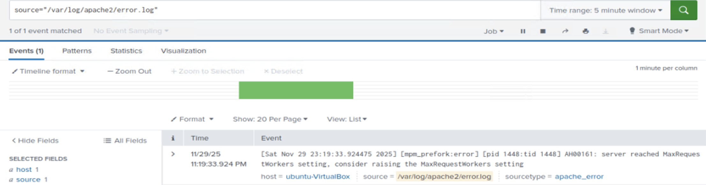
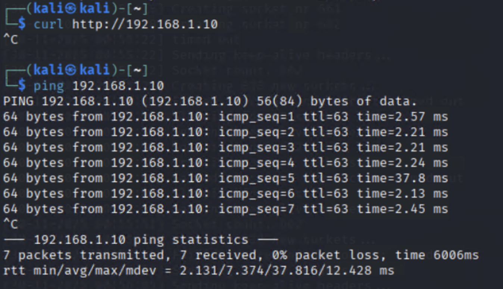

# Network Segmentation & Application-Layer DoS Lab

A hands-on offensive-and-defensive lab built inside a single VirtualBox sandbox. It has two parts that share the same environment:

- **Part 1 — Network Segmentation & Access Control.** Build a multi-subnet network separated by a pfSense firewall, design an access-control matrix, enforce it with router- and host-level rules, and validate enforcement with active scanning and packet captures.
- **Part 2 — Slowloris Application-Layer DoS.** Use that same segmented sandbox to run a controlled low-bandwidth DoS attack against an Apache web server, then detect and analyze it with Splunk, packet captures, and host telemetry — and document mitigations.

The two parts tell one story: first stand up and lock down a realistic network, then attack a service inside it and prove you can see the attack in your telemetry.

**Project type:** Targeted research (authorized, isolated sandbox only)
**Role:** Lab builder & test executor
**Date:** Fall 2025

> **Note on addressing:** the two exercises were run as separate sessions on the same sandbox design, so the exact subnet numbering differs between them (Part 1 uses `192.168.10.0/24` / `192.168.20.0/24`; Part 2 uses `192.168.1.0/24` / `192.168.2.0/24`). Each part below documents the addressing it actually used.

---

## Table of Contents

**Part 1 — Network Segmentation & Access Control**

1. [Overview](#part-1-overview)
2. [Sandbox Components](#sandbox-components)
3. [Tools & Technologies](#tools--technologies-used)
4. [Network Topology](#network-topology)
5. [Setup](#setup-high-level-steps)
6. [Discovery & Baseline Validation](#discovery--baseline-validation)
7. [Security Policy Implementation](#security-policy-implementation)
8. [Post-Implementation Verification](#post-implementation-verification)
9. [Host-Level Firewall](#host-level-firewall-server-a1)
10. [Part 1 Outcomes](#part-1-outcomes)

**Part 2 — Slowloris Application-Layer DoS**

12. [Overview](#part-2-overview)
13. [Skills Demonstrated](#skills-demonstrated)
14. [Why This Matters](#why-this-matters)
15. [Lab Environment & Topology](#lab-environment--topology)
16. [Splunk Configuration & Ingestion Validation](#splunk-configuration--ingestion-validation)
17. [Pre-Attack Assessment](#pre-attack-assessment)
18. [Pre-Attack Tuning (Kali)](#pre-attack-tuning-kali)
19. [Executing the Slowloris Attack](#executing-the-slowloris-attack)
20. [Evidence & Attack Verification](#evidence--attack-verification)
21. [Technical Analysis — Why the Attack Worked](#technical-analysis--why-the-attack-worked)
22. [Detection Engineering Insights](#detection-engineering-insights)
23. [Security Impact](#security-impact)
24. [Mitigation Recommendations](#mitigation-recommendations)
25. [Part 2 Outcomes](#part-2-outcomes)


[Ethical Notice](#ethical-notice)

---
---

# Part 1 — Network Segmentation & Access Control

## Part 1 Overview
A repeatable VirtualBox-based sandbox designed to implement, enforce, and verify network security policies. The environment models an internal company network and an external attacker network separated by a pfSense virtual router. The project demonstrates how to combine router-level rules and host-level firewall controls, and how to validate enforcement using active scanning and packet captures.

## Sandbox components
- **Network A (Internal / Company)** — Ubuntu Desktop (server) and Windows XP (workstation)
- **Network B (External / Attacker)** — Kali Linux (attacker / scanner) and Windows 95 (legacy)
- **Router / Firewall** — pfSense virtual appliance connecting Network A and Network B

**Notes / lessons learned**
- Resolved legacy VM patching and NIC misconfiguration issues to keep the environment reproducible.
- Identified policy items that require host-level enforcement when gateway rules were insufficient.
- Captured configuration and verification artifacts so the sandbox can be re-created for future testing.

---

## Tools & technologies used
- **Virtualization:** VirtualBox (VM creation, NIC binding, snapshots)
- **Router & firewall:** pfSense (interface configuration, rule authoring, logging)
- **Operating systems:** Ubuntu, Kali Linux, Windows XP, Windows 95 (legacy)
- **Network analysis & scanning:** Wireshark, tcpdump, Nmap / Zenmap
- **Services:** Apache (HTTP), OpenSSH (SSH)
- **Host hardening:** iptables (Ubuntu)
- **Testing & validation:** curl, ping, ssh

---

## Network topology


*A.1 = Ubuntu (server), A.2 = Windows XP (workstation), pfSense = router, B.1 = Kali, B.2 = Windows 95 (legacy).*

---

## Setup (high-level steps)

1. Installed Oracle VirtualBox and provisioned VMs for Ubuntu, Kali, Windows XP, and Windows 95.
   

2. Configured pfSense with two interfaces: `LAN` for Network A and `OPT1` for Network B.
   

3. Assigned static IPs and verified NIC-to-subnet mappings.
4. Installed Apache and OpenSSH on the internal server (A.1) and verified services.
5. Installed Wireshark and Nmap on attacker and server VMs for traffic capture and scanning.
6. Validated baseline connectivity using `ping`, `curl`, and `ssh`.
7. Documented environment quirks (snapshots + notes) to ensure reproducibility.

---

## Discovery & baseline validation
Performed discovery scans and packet captures to establish a clear baseline before any policy changes.

- Nmap scans from the attacker VM (Kali) to enumerate services and ports.
- Wireshark/tcpdump captures during ping, curl, and ssh to verify normal traffic patterns.
- Baseline evidence saved for before/after comparison.

### Selected baseline captures
**Ping and curl from attacker → server**


**SSH from attacker → server**


**pfSense packet capture (attacker → server)**


**Ping from attacker → workstation**


**Failed curl/ssh from attacker → workstation (expected after rules)**


**Ping & curl within external network**


**Internal workstation → internal server traffic**


### Nmap baseline examples


---

## Security policy implementation
Policy enforcement was implemented primarily in pfSense. Host-level controls (iptables) were used for policy items the router could not express.

**Corporate policy summary**
- Server: HTTP and SSH allowed internally; HTTP allowed externally (read-only).
- Workstations: allowed to initiate internal access but not host external services.
- Server must not initiate external connections.
- External hosts should not be able to ping internal hosts.

### Access control matrix


### pfSense rules (visual snapshots)
**WAN rules**


**LAN rules**


**OPT1 rules**


---

## Post-implementation verification
- Nmap confirmed only authorized services were exposed after rules applied.
- Wireshark captures validated that blocked traffic did not traverse internal interfaces.
- System and firewall logs corroborated rule enforcement.


---

## Host-level firewall (server A.1)
Applied host-level iptables rules to enforce policies that could not be implemented at the gateway.

```bash
sudo iptables -A OUTPUT -d 192.168.20.0/24 -j DROP
sudo iptables -A INPUT -p tcp --dport 22 -s 192.168.10.0/24 -j ACCEPT
sudo iptables -A INPUT -p tcp --dport 80 -j ACCEPT
sudo iptables -A INPUT -p icmp -s 192.168.10.0/24 -j ACCEPT
```
 

## Part 1 Outcomes
- Created a reproducible lab environment for network policy testing and security validation.
- Implemented defense-in-depth with combined router and host controls.
- Validated enforcement and produced reproducible evidence (scans, captures, and logs) to support detection and remediation workflows.

---
---

# Part 2 — Slowloris Application-Layer DoS

## Part 2 Overview
A controlled study of application-layer Denial-of-Service (Slowloris) against an Apache2 web server in the isolated VirtualBox sandbox from Part 1. The exercise focused on attack mechanics, SIEM ingestion and detection, packet- and host-level telemetry analysis, and operational mitigations.

## Skills demonstrated
- Application-layer DoS emulation (Slowloris)
- VirtualBox sandbox and pfSense topology management
- SIEM ingestion and detection engineering (Splunk)
- Network discovery and reconnaissance (Nmap)
- Packet- and host-level forensics (Wireshark, tcpdump, Apache logs)
- Reproducible documentation and defensive recommendations

## Why this matters
Slowloris-style attacks can render web services unavailable while using very little bandwidth. Demonstrating both attack execution and detection shows the ability to reason about attacker techniques, validate telemetry, and operationalize detection and response.

---

## Lab environment & topology
- **Network A (internal)** — `192.168.1.0/24`
  - Ubuntu (Web server / Apache2): `192.168.1.10`
  - Windows XP (Workstation): `192.168.1.15`
- **Network B (attacker / external)** — `192.168.2.0/24`
  - Kali Linux (Attacker): `192.168.2.16`
- **Router / Firewall:** pfSense (LAN <-> Network A, OPT1/WAN <-> Network B)
- **Monitoring:** Splunk (ingesting `/var/log/apache2/access.log` and `/var/log/apache2/error.log`)



---

## Splunk: configuration & ingestion validation
Configured Splunk to ingest Apache logs from the victim VM:

- `/var/log/apache2/access.log` (sourcetype: `apache:access`)
- `/var/log/apache2/error.log` (sourcetype: `apache:error`)

Validation steps:
1. Confirmed log files appear in Splunk with expected sourcetypes.
2. Built initial search to surface `MaxRequestWorkers` and related Apache errors.
3. Correlated timestamps between Splunk events and live availability tests.

---

## Pre-attack assessment
From the attacker VM (Kali):

- Performed quick port/service enumeration with Nmap.
  

- Verified HTTP service with curl:
```bash
curl http://192.168.1.10/testsplunk
```


---

## Pre-attack tuning (Kali)
Slowloris uses many sockets; increased file-descriptor limits before running:

```bash
# Soft limit
ulimit -S -n 8192

# Hard limit
ulimit -H -n 16384
```

## Executing the Slowloris attack

Command used:
```bash
slowloris -v -p 80 -s 1500 --sleeptime 10 192.168.1.10
```

Command explanation:
- ``` -v ``` = verbose output
- ``` -p 80 ```= HTTP port
- ``` -s 1500 ```= number of sockets (tuned to VM limits)
- ``` --sleeptime 10 ``` = seconds between header refresh attempts

Attack visualization:



## Evidence & Attack Verification

### Apache Error Log Evidence (Splunk)
Splunk detected worker exhaustion indicators during the attack window.



---

### Application Availability Impact
Application-layer failure was confirmed using cross-terminal testing.

- HTTP requests stalled during the attack
- ICMP traffic remained functional

This confirmed application-layer resource exhaustion rather than a full network outage.



---

## Technical Analysis — Why the Attack Worked

Slowloris succeeds by exhausting application resources rather than bandwidth.

### Attack Mechanics
- Opens many concurrent HTTP connections
- Sends HTTP headers extremely slowly
- Keeps connections alive using periodic header refreshes
- Prevents Apache from completing request processing

### Server-Side Behavior
- Apache assigns worker threads per connection
- Workers remain locked waiting for full HTTP headers
- Keep-alive and timeout configurations allowed connections to persist
- Eventually MaxRequestWorkers was reached

### Environmental Vulnerability Factors
- Worker limits were low relative to socket volume
- Permissive keep-alive and timeout settings
- Increased attacker socket capacity via ulimit tuning

---

## Detection Engineering Insights

Attack detection was validated using multiple independent signals.

### SIEM Correlation
- Apache error logs
- Availability metrics
- Time-synchronized attack activity

### Packet-Level Indicators
- Partial or incomplete HTTP headers
- Long-lived TCP sessions without completed requests

---

## Security Impact

- Demonstrated that low-bandwidth application-layer attacks can cause full service degradation
- Reinforced the importance of application telemetry monitoring
- Showed need for layered security beyond network monitoring

---

## Mitigation Recommendations

### Application Hardening
- Tune Apache worker and timeout thresholds
- Implement per-IP rate limiting
- Restrict persistent connections where possible

### Architecture Defenses
- Deploy reverse proxies or load balancers
- Add upstream connection throttling

### Detection Improvements
- Create SIEM alerts for worker exhaustion patterns
- Monitor abnormal connection persistence behavior

---

## Part 2 Outcomes
- Successfully executed and documented Slowloris DoS testing in an isolated environment
- Built detection validation workflows using SIEM and telemetry
- Produced defensive guidance and reproducible test evidence

---

## Ethical Notice
All testing was performed in an authorized, isolated lab environment for defensive research purposes only. Do not reproduce on systems you do not own or have permission to test.
